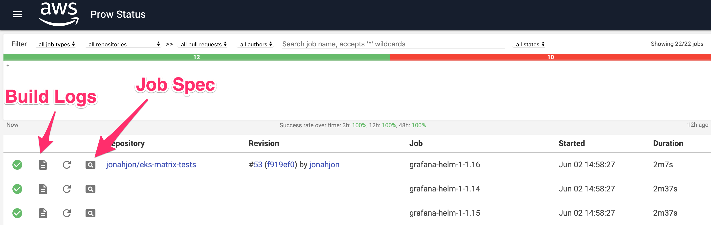

## Aquarium K8s Test Coverage

This repository contains tools and configuration files for the testing 3rd party software on various versions of Amazon EKS. 


Aquarium is built upon [Prow](https://github.com/kubernetes/test-infra/tree/master/prow) which is a Kubernetes based CI/CD system. Jobs can be triggered by various types of events and report their status to many different services. In addition to job execution, Prow provides GitHub automation in the form of policy enforcement, chat-ops via `/foo` style commands.


Current Supported Platforms:
- EKS K8s version 1.14
- EKS K8s version 1.15
- EKS K8s version 1.16

The [architecture diagram](static/architecture.png) provides an overview of how the different services interact, and test on EKS clusters.


## Getting Started Testing Your Software 

For onboarding 3rd party software onto Aquarium there a minimum of two steps needed to be completed. Fork this repoisotory, and create a PR to get included into this system.

1. Add in a job definition and OWNERS file To read more about about job configuration check out [Prow Job FAQ](/prow/jobs/README.md#adding-or-updating-jobs)

## I Want to Onboard

These are the steps needed to onboard your software onto Aquarium. Let's walkthrough onboarding a ``` Unicorn ``` service

1).  Create a directory in ``` prow/jobs/unicorn ``` and add an OWNERS file. This will control access to who can approve/merge PR's in ``` prow/jobs/unicorn ```


- [Create a directory and OWNER file](/prow/jobs/README.md#adding-or-updating-jobs)

2). Create a job that tests the unicorn software. 

```yaml
presubmits:
  jonahjon/eks-matrix-tests: # The github user/repo
  - name: unicorn-helm-114  # convention (software)-(test type)-(EKS verssion)

    cluster: eks-114 # which cluster the base prowjob runs on (eks-114|eks-115|eks-116|prow)

    skip_report: false # report status to github ... set to true when trying new tests

    agent: kubernetes 

    run_if_changed: "^(images/unicorn/|prow/jobs/unicorn/)" # run the job if files in images/unicorn or prow/jobs/unicorn change

    decorate: false # set to true this will upload the entire repository PR hash into the container image. Useful when building images

    path_alias: github.com/jonahjon/eks-matrix-tests # the path that the repository will be cloned to if decorate:true is set

    branches:
      - ^master$ # Run on anything besides master

    spec:
      containers:
      - command:
        - usr/local/bin/helm.sh # the testing script from images/unicorn/helm.sh

        - "1_15" # the arguement used by the bootstrap image to launch additional components into

        env:
        - name: AWS_DEFAULT_REGION
          value: us-west-2
        image: 164382793440.dkr.ecr.us-west-2.amazonaws.com/unicorn/helm # the image used for testing, from images/unicorn

```
By default everytime a job is changed/added/deleted a prowjob called ```update-jobs``` will run and re-sync the system. To learn more about prowjobs checkout the readme, or the official Kubernetes Readme

- [Add or update job definition](/prow/jobs/README.md#adding-or-updating-jobs)

- [Kubernetes Prow Jobs](https://github.com/kubernetes/test-infra/blob/master/prow/jobs.md)


3). This step is optional, but a public image can also be provided.

Now that you've added the prowjob, we are going to create the image used by our prowjob. We creare the directory ```images/unicorn``` and add in a our build steps, and test files we will be using. We then add an image building job in to listen, and build new images of ```unicorn```

```yaml
presubmits:
  jonahjon/eks-matrix-tests: 
  - name: unicorn-image
    decorate: true
    path_alias: github.com/jonahjon/eks-matrix-tests
    cluster: prow # This is now running in our base prow cluster, not a testing cluster. 
    skip_report: false
    agent: kubernetes
    run_if_changed: '^images/unicorn/'
    branches:
      - ^master$
    spec:
      containers:
      - command:
          - "/home/prow/go/src/github.com/jonahjon/eks-matrix-tests/images/publish-image.sh" #We are using the publish-image.sh script which requires a makefile in your images folder. This can be changed.
        args:
          - "/home/prow/go/src/github.com/jonahjon/eks-matrix-tests/images/grafana" # We provide the publish-image.sh the location in which we want it to run the Makefile for, which handles the build/push
        env:
        - name: AWS_DEFAULT_REGION
          value: us-west-2
        image: 164382793440.dkr.ecr.us-west-2.amazonaws.com/bootstrap # Our base debain stretch image has Docker, Docker IN Docker, awscli, and access to all clusters
        imagePullPolicy: Always
        resources:
          requests:
            memory: 1.5Gi
            cpu: 0.8
            ephemeral-storage: "1Gi"
        securityContext: # this is required when pods perform builds of images
          privileged: true
```

To see more information about the image building check out:

- [OPTIONAL: Add or update images/tests](/images/README.md#adding-or-updating-tests)


## Results and Logs

Aquarium test results, and test logs can be found on the deck server http://a69660e52137f4cbcaefaf44e7c02ebb-1275564336.us-west-2.elb.amazonaws.com/

The [architecture diagram](static/architecture.png) provides an overview of how the different services interact, and test on EKS.




## Re-Testing PR Workflow


## Build Badges

basic badge sytnax for deck jobs is:

	http://PROW-URL/badge.svg?jobs=eks-open-source-readme


# Test Results


### Grafana

| Install Method | v1.16 | v1.15 | v1.14 | 
| ----------- | ----------- | ----------- | -----------
| **Helm** | [](http://a69660e52137f4cbcaefaf44e7c02ebb-1275564336.us-west-2.elb.amazonaws.com/badge.svg?jobs=grafana-helm-1-1.16) | [](http://a69660e52137f4cbcaefaf44e7c02ebb-1275564336.us-west-2.elb.amazonaws.com/badge.svg?jobs=grafana-helm-1-1.15) | [](http://a69660e52137f4cbcaefaf44e7c02ebb-1275564336.us-west-2.elb.amazonaws.com/badge.svg?jobs=grafana-helm-1-1.14)
| **Kubectl** | [](http://a69660e52137f4cbcaefaf44e7c02ebb-1275564336.us-west-2.elb.amazonaws.com/badge.svg?jobs=grafana-kubectl-1-1.16) | [](http://a69660e52137f4cbcaefaf44e7c02ebb-1275564336.us-west-2.elb.amazonaws.com/badge.svg?jobs=grafana-kubectl-1-1.15) | [](http://a69660e52137f4cbcaefaf44e7c02ebb-1275564336.us-west-2.elb.amazonaws.com/badge.svg?jobs=grafana-kubectl-1-1.14)


### Prometheus

| Install Method | v1.16 | v1.15 | v1.14 | 
| ----------- | ----------- | ----------- | -----------
| **Helm** | [](http://a69660e52137f4cbcaefaf44e7c02ebb-1275564336.us-west-2.elb.amazonaws.com/badge.svg?jobs=partner-product1-1.16) | [](http://a69660e52137f4cbcaefaf44e7c02ebb-1275564336.us-west-2.elb.amazonaws.com/badge.svg?jobs=partner-product1-1.15) | [](http://a69660e52137f4cbcaefaf44e7c02ebb-1275564336.us-west-2.elb.amazonaws.com/badge.svg?jobs=partner-product1-1.14)
| **Kubectl** | [](http://a69660e52137f4cbcaefaf44e7c02ebb-1275564336.us-west-2.elb.amazonaws.com/badge.svg?jobs=partner-product2-1.16) | [](http://a69660e52137f4cbcaefaf44e7c02ebb-1275564336.us-west-2.elb.amazonaws.com/badge.svg?jobs=partner-product2-1.15) | [](http://a69660e52137f4cbcaefaf44e7c02ebb-1275564336.us-west-2.elb.amazonaws.com/badge.svg?jobs=partner-product2-1.14)


